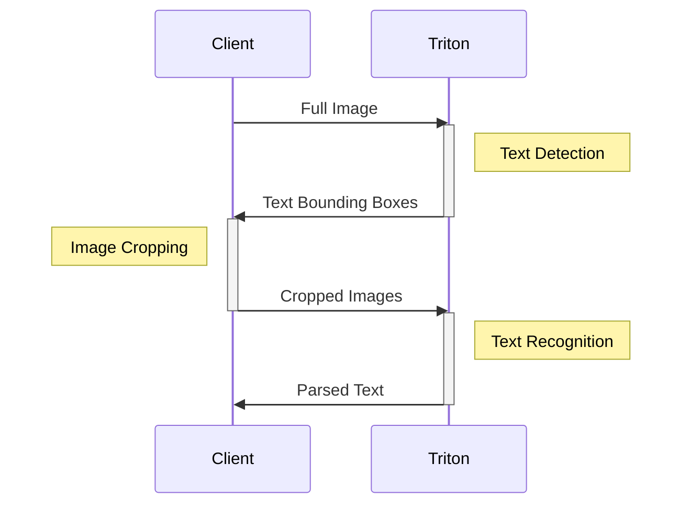
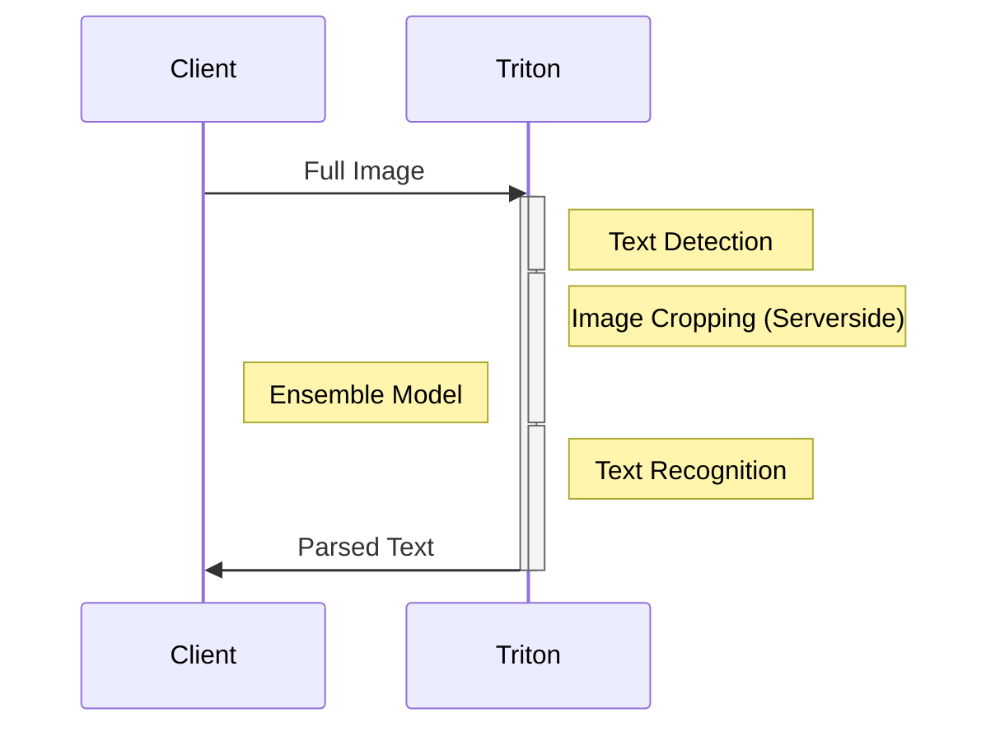
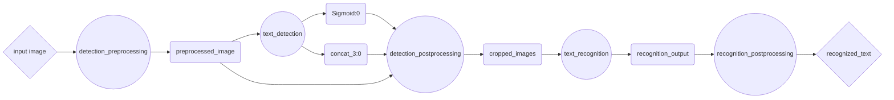

<!--
# Copyright 2023-2026, NVIDIA CORPORATION & AFFILIATES. All rights reserved.
#
# Redistribution and use in source and binary forms, with or without
# modification, are permitted provided that the following conditions
# are met:
#  * Redistributions of source code must retain the above copyright
#    notice, this list of conditions and the following disclaimer.
#  * Redistributions in binary form must reproduce the above copyright
#    notice, this list of conditions and the following disclaimer in the
#    documentation and/or other materials provided with the distribution.
#  * Neither the name of NVIDIA CORPORATION nor the names of its
#    contributors may be used to endorse or promote products derived
#    from this software without specific prior written permission.
#
# THIS SOFTWARE IS PROVIDED BY THE COPYRIGHT HOLDERS ``AS IS'' AND ANY
# EXPRESS OR IMPLIED WARRANTIES, INCLUDING, BUT NOT LIMITED TO, THE
# IMPLIED WARRANTIES OF MERCHANTABILITY AND FITNESS FOR A PARTICULAR
# PURPOSE ARE DISCLAIMED.  IN NO EVENT SHALL THE COPYRIGHT OWNER OR
# CONTRIBUTORS BE LIABLE FOR ANY DIRECT, INDIRECT, INCIDENTAL, SPECIAL,
# EXEMPLARY, OR CONSEQUENTIAL DAMAGES (INCLUDING, BUT NOT LIMITED TO,
# PROCUREMENT OF SUBSTITUTE GOODS OR SERVICES; LOSS OF USE, DATA, OR
# PROFITS; OR BUSINESS INTERRUPTION) HOWEVER CAUSED AND ON ANY THEORY
# OF LIABILITY, WHETHER IN CONTRACT, STRICT LIABILITY, OR TORT
# (INCLUDING NEGLIGENCE OR OTHERWISE) ARISING IN ANY WAY OUT OF THE USE
# OF THIS SOFTWARE, EVEN IF ADVISED OF THE POSSIBILITY OF SUCH DAMAGE.
-->


# 使用模型集成执行多个模型（Executing Multiple Models with Model Ensembles）

| 跳转到 | [第 4 部分：模型加速](../Part_4-inference_acceleration/)  | [第 6 部分：使用 BLS API 构建复杂流水线](../Part_6-building_complex_pipelines/) | [文档：集成（Ensembles）](https://docs.nvidia.com/deeplearning/triton-inference-server/user-guide/docs/user_guide/architecture.html#ensemble-models)
| ------------ | --------------- | --------------- | --------------- |

现代机器学习系统经常需要执行多个模型，无论是出于前/后处理步骤、聚合多个模型的预测，还是让不同模型执行不同任务。在本示例中，我们将探索如何使用模型集成（Model Ensembles）在服务端仅用一次网络调用执行多个模型。这带来的好处是减少客户端与服务器之间复制数据的次数，并消除一部分网络调用固有的延迟。

为了演示创建模型集成的过程，我们将复用[第 1 部分](../Part_1-model_deployment/README.md)首次介绍的模型流水线。在之前的示例中，文本检测和识别模型是分开执行的，我们的客户端发出了两次不同的网络调用，并在其间执行各种处理步骤——比如裁剪和缩放图片、把张量解码成文本。下面是流水线的简化图，部分步骤发生在客户端，部分在服务器。



为了减少必要的网络调用和数据拷贝次数（同时利用可能更强大的服务器来执行前/后处理），我们可以使用 Triton 的[模型集成（Model Ensemble）](https://docs.nvidia.com/deeplearning/triton-inference-server/user-guide/docs/user_guide/architecture.html#ensemble-models)特性，用一次网络调用执行多个模型。



让我们看看如何创建一个 Triton 模型集成。

**注意（Note）：** 如果你想找一个示例来理解数据在集成中的流转方式，[参考这个教程](../../Feature_Guide/Data_Pipelines/README.md)！

> 💡 **AI Infra 视角**：Ensemble 把"一次请求 → 多次网络往返"变成"一次请求 → 服务端内部走完流水线"。收益不仅是省网络延迟：图片等大对象不用在客户端和服务器之间来回搬运，前/后处理也能用上服务器的算力。在推理平台设计中，凡是有固定数据流（DAG 结构）的多模型链路，都值得优先考虑 Ensemble 而不是客户端串联。

## 部署基础模型（Deploy Base Models）

第一步是像以前一样，把文本检测和文本识别模型作为普通 Triton 模型部署。关于向 Triton 部署模型的详细介绍，请看本教程的[第 1 部分](../Part_1-model_deployment/README.md)。为了方便，我们提供了两个导出这些模型的 shell 脚本。

>注意：我们建议在 NGC TensorFlow 容器环境中执行以下步骤，可用 `docker run -it --gpus all -v ${PWD}:/workspace nvcr.io/nvidia/tensorflow:<yy.mm>-tf2-py3` 启动该容器。

```bash
bash utils/export_text_detection.sh
```

>注意：我们建议在 NGC PyTorch 容器环境中执行以下步骤，可用 `docker run -it --gpus all -v ${PWD}:/workspace nvcr.io/nvidia/pytorch:<yy.mm>-py3` 启动该容器。

```bash
bash utils/export_text_recognition.sh
```

## 用 Python Backend 部署前/后处理脚本

在本教程之前的章节中，我们创建的客户端脚本会在客户端进程内执行各种前/后处理步骤。例如在[第 1 部分](../Part_1-model_deployment/README.md)中，我们创建了脚本 [`client.py`](../Part_1-model_deployment/client.py)，它：
1. 读取图片
2. 对图片做缩放和归一化
3. 把图片发送给 Triton 服务器
4. 根据文本检测模型返回的边界框裁剪图片
5. 对图片做缩放和归一化
6. 把裁剪后的图片发送给 Triton 服务器
7. 把文本识别模型返回的张量解码成文本
8. 打印解码出的文本

为了把其中许多步骤移到 Triton 服务器上，我们可以创建一组脚本，运行在 [Triton 的 Python Backend](https://github.com/triton-inference-server/python_backend) 中。Python backend 可以执行任何 Python 代码，所以我们可以把客户端代码几乎原样移植到 Triton，只需要少量改动。

要在 Python Backend 上部署模型，可以在模型仓库中按如下结构创建一个目录（其中 `my_python_model` 可以是任意名字）：

```
my_python_model/
├── 1
│   └── model.py
└── config.pbtxt
```

我们总共会创建 3 个不同的 python backend 模型，与现有的 ONNX 模型一起由 Triton 服务：

1. `detection_preprocessing`
2. `detection_postprocessing`
3. `recognition_postprocessing`

这些模型完整的 `model.py` 脚本可以在本目录的 `model_repository` 文件夹中找到。

我们来看一个示例。在 `model.py` 中，我们定义了一个 `TritonPythonModel` 类，包含以下方法：

```python
class TritonPythonModel:
    def initialize(self, args):
        ...
    def execute(self, requests):
        ...
    def finalize(self):
        ...
```

`initialize` 和 `finalize` 方法是可选的，分别在模型加载和卸载时被调用。主要逻辑放在 `execute` 方法中，它接收一个请求对象的_列表_，并且必须返回一个响应对象的列表。

在我们最初的客户端中，有以下读取图片并做简单变换的代码：

```python
### client.py

image = cv2.imread("./img1.jpg")
image_height, image_width, image_channels = image.shape

# Pre-process image
blob = cv2.dnn.blobFromImage(image, 1.0, (inpWidth, inpHeight), (123.68, 116.78, 103.94), True, False)
blob = np.transpose(blob, (0, 2,3,1))

# Create input object
input_tensors = [
    httpclient.InferInput('input_images:0', blob.shape, "FP32")
]
input_tensors[0].set_data_from_numpy(blob, binary_data=True)
```

在 python backend 中执行时，我们需要确保代码能处理输入列表。另外，我们不再从磁盘读取图片——而是直接从 Triton 服务器提供的输入张量中获取。

```python
### model.py

responses = []
for request in requests:
    # Read input tensor from Triton
    in_0 = pb_utils.get_input_tensor_by_name(request, "detection_preprocessing_input")
    img = in_0.as_numpy()
    image = Image.open(io.BytesIO(img.tobytes()))

    # Pre-process image
    img_out = image_loader(image)
    img_out = np.array(img_out)*255.0

    # Create object to send to next model
    out_tensor_0 = pb_utils.Tensor("detection_preprocessing_output", img_out.astype(output0_dtype))
    inference_response = pb_utils.InferenceResponse(output_tensors=[out_tensor_0])
    responses.append(inference_response)
return responses
```


## 用模型集成把模型串联起来

现在流水线的每个独立部分都可以单独部署了，我们可以创建一个集成"模型"，按顺序执行每个模型，并在模型之间传递各种输入输出。

为此，我们再往模型仓库中添加一个条目：

```
ensemble_model/
├── 1
└── config.pbtxt
```

这一次，我们只需要配置文件来描述我们的集成，外加一个空的版本文件夹（你需要用 `mkdir -p model_repository/ensemble_model/1` 创建它）。在配置文件中，我们将定义集成的执行图。这个图描述了集成的整体输入输出，以及数据以有向无环图（Directed Acyclic Graph，DAG）的形式流经模型的方式。下图是我们模型流水线的图形化表示。菱形代表集成的最终输入和输出，也就是客户端需要交互的全部内容；圆形是部署的不同模型；矩形是在模型之间传递的张量。



为了向 Triton 描述这个图，我们将创建下面的配置文件。注意我们是如何把 platform 定义为 `"ensemble"`，并指定集成本身的输入输出的。然后在 `ensemble_scheduling` 块中，我们为集成的每个 `step`（步骤）创建一个条目，包括要执行的模型名称，以及该模型的输入输出如何映射到整个集成的输入输出或其他模型的输入输出。

<details>
<summary> 展开查看集成配置文件 </summary>

```text proto
name: "ensemble_model"
platform: "ensemble"
max_batch_size: 256
input [
  {
    name: "input_image"
    data_type: TYPE_UINT8
    dims: [ -1 ]
  }
]
output [
  {
    name: "recognized_text"
    data_type: TYPE_STRING
    dims: [ -1 ]
  }
]

ensemble_scheduling {
  step [
    {
      model_name: "detection_preprocessing"
      model_version: -1
      input_map {
        key: "detection_preprocessing_input"
        value: "input_image"
      }
      output_map {
        key: "detection_preprocessing_output"
        value: "preprocessed_image"
      }
    },
    {
      model_name: "text_detection"
      model_version: -1
      input_map {
        key: "input_images:0"
        value: "preprocessed_image"
      }
      output_map {
        key: "feature_fusion/Conv_7/Sigmoid:0"
        value: "Sigmoid:0"
      },
      output_map {
        key: "feature_fusion/concat_3:0"
        value: "concat_3:0"
      }
    },
    {
      model_name: "detection_postprocessing"
      model_version: -1
      input_map {
        key: "detection_postprocessing_input_1"
        value: "Sigmoid:0"
      }
      input_map {
        key: "detection_postprocessing_input_2"
        value: "concat_3:0"
      }
      input_map {
        key: "detection_postprocessing_input_3"
        value: "preprocessed_image"
      }
      output_map {
        key: "detection_postprocessing_output"
        value: "cropped_images"
      }
    },
    {
      model_name: "text_recognition"
      model_version: -1
      input_map {
        key: "INPUT__0"
        value: "cropped_images"
      }
      output_map {
        key: "OUTPUT__0"
        value: "recognition_output"
      }
    },
    {
      model_name: "recognition_postprocessing"
      model_version: -1
      input_map {
        key: "recognition_postprocessing_input"
        value: "recognition_output"
      }
      output_map {
        key: "recognition_postprocessing_output"
        value: "recognized_text"
      }
    }
  ]
}
```

</details>

## 启动 Triton

我们将再次使用 docker 容器启动 Triton。这一次，我们在容器内开启一个交互式会话，而不是直接启动 triton server。

```bash
docker run --gpus=all -it --shm-size=1G --rm  \
  -p8000:8000 -p8001:8001 -p8002:8002 \
  -v ${PWD}:/workspace/ -v ${PWD}/model_repository:/models \
  nvcr.io/nvidia/tritonserver:26.07-py3
```

我们需要为 Python backend 脚本安装几个依赖。

```bash
pip install torchvision opencv-python-headless
```

然后启动 Triton：

```bash
tritonserver --model-repository=/models
```

## 创建新客户端

现在我们已经把之前客户端的大量复杂逻辑移到了不同的 Triton backend 脚本中，我们可以创建一个大大简化的客户端来与 Triton 通信。

```python
## client.py

import tritonclient.grpc as grpcclient
import numpy as np

client = grpcclient.InferenceServerClient(url="localhost:8001")

image_data = np.fromfile("img1.jpg", dtype="uint8")
image_data = np.expand_dims(image_data, axis=0)

input_tensors = [grpcclient.InferInput("input_image", image_data.shape, "UINT8")]
input_tensors[0].set_data_from_numpy(image_data)
results = client.infer(model_name="ensemble_model", inputs=input_tensors)
output_data = results.as_numpy("recognized_text").astype(str)
print(output_data)
```

现在，执行以下命令运行完整推理流水线：

```
python client.py
```

你应该会在控制台上看到解析出的文本。

## 接下来是什么

在这个示例中，我们展示了如何使用模型集成（Model Ensembles）在 Triton 上用一次网络调用执行多个模型。当你的模型流水线是有向无环图（DAG）形式时，模型集成是一个非常棒的方案。然而，并非所有流水线都能这样表达。例如，如果流水线逻辑需要条件分支或循环执行，你可能需要一种更具表达力的方式来定义流水线。在[下一个示例](../Part_6-building_complex_pipelines/)中，我们将探索如何使用[业务逻辑脚本（Business Logic Scripting）](https://github.com/triton-inference-server/python_backend#business-logic-scripting)在 Python 中定义更复杂的流水线。

> 💡 **AI Infra 视角**：对比第 1 部分的客户端串联和这里的 Ensemble，你会发现"处理逻辑放哪"是推理架构设计的重要决策：放客户端灵活但多一次网络往返，放 Ensemble 高效但要求数据流是固定的 DAG。当流水线需要 if/else 或循环时（比如按检测结果决定走哪个分支），Ensemble 就表达不了了——这正是第 6 部分 BLS 的用武之地。
